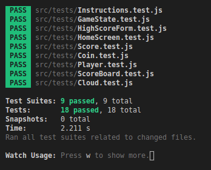

# Project 3 - Client-side JS App using React

## Description
I created a game that I have called Cloud Jumper using ReactJS.

 

# #Requirements
My game satisfies all of the requirements. It uses 11 React components, 3 JSON files, 18 tests, and is deployed.
 

## Installation
To install the game, clone this github repository. Next, run "npm install". You can either run the unit tests by typing "npm run test" or play the game by running "npm start". You can also play the game by going to this link https://drakecullen.github.io/.
 

## Instructions
Move the player left and right by holding the corresponding arrow key. Land on clouds to jump, and grab coins to earn points! Try to make it on the leaderboard.

 

All my test cases passed!

 

 

Here is a quick GIF of the game running:

 

